# Image Processing Practicals

These are the set of practicals done under the course of Image Processing at colleges affiliated to the Goa University. These are done using a GUI (Graphical User Interface) which helps to observe the results in a more efficient way. 

## Getting Started

These instructions will get you a copy of the project up and running on your local machine for development and testing purposes.

### Prerequisites

Java Editor (Intellij Idea is most preferred)

## Experiment Names
<ul>
  <li>Read and Write an Image in Java</li>
  <li>Create a GUI using Java</li>
  <li>Grayscale Conversion</li>
  <li>Gray Level Slicing (Lowering background)li>
  <li>Gray Level Slicing (Retaining background)li>
  <li>Bit Plane Slicing</li>
  <li>Contrast Stretching</li>
  <li>Box Filter</li>
  <li>Weighted Average Filter</li>
  <li>Median Filter</li>
  <li>Image Smoothing</li>
  <li>Image Sharpening</li>
  <li>Histogram of an Image</li>
  <li>Histogram Equalization</li>
  <li>Optimal Thresholding</li>
  <li>Grayscale Erosion</li>
  <li>Virtual Laboratory - Image Segmentation</li>
</ul>

## EXPERIMENT 1
The BufferedImage and ImageIO Libraries are used to carry out this section of the experiment.  
<pre>int width = 963;  
int height = 640;  
BufferedImage image = null;  
File f = null; 
f = new File("j2.jpg"); 
 
//read image
image = new BufferedImage(width, height, BufferedImage.TYPE_INT_ARGB);  
image = ImageIO.read(f);  
System.out.println("Reading complete.");  

//write image  
f = new File("Output.jpg");  
ImageIO.write(image, "jpg", f); 
System.out.println("Writing complete.");  
</pre>

<b>OUTPUT</b> 
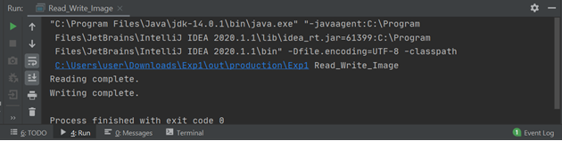

## EXPERIMENT 2
Various classes like Labels, panels, buttons are used to create the GUI. Most of it is worked on using the Drag and Drop Functionality. Formating and editing can be done using coding.
 
<b>OUTPUT</b> 
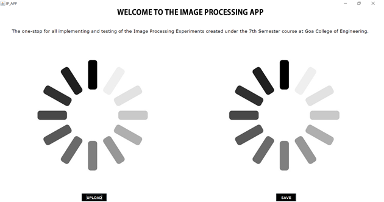
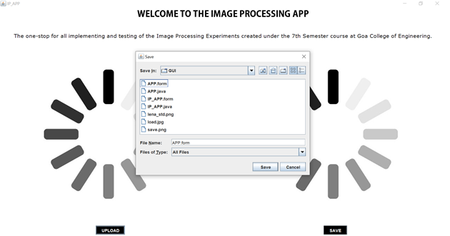
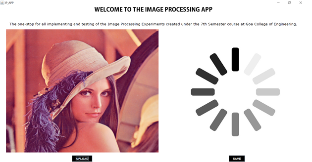
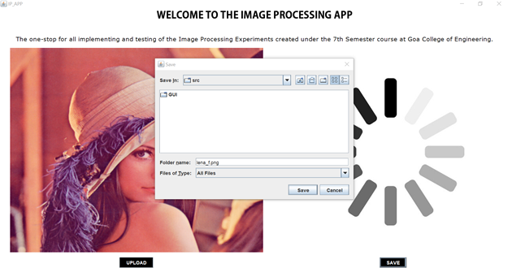
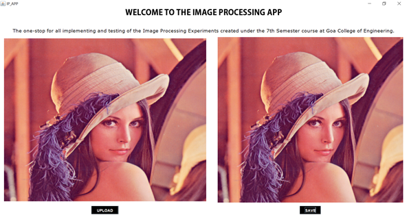

## EXPERIMENT 3
An RGB image can be converted to grayscale by converting each pixel to its grayscale intensity. There are 2 methods to do this. The use of in-built functions or not is your choice.
<pre>
BufferedImage GrayScaleAction(java.awt.event.ActionEvent evt, File f, BufferedImage img){
        int width = img.getWidth();
        int height = img.getHeight();
        for (int y = 0; y < height; y++) {
            for (int x = 0; x < width; x++) {
                int p = img.getRGB(x, y);
                int alpha = (p >> 24) & 0xff;
                int r = (p >> 16) & 0xff;
                int g = (p >> 8) & 0xff;
                int b = p & 0xff;
                int gray = (int) (0.216 * r + 0.7152 * g + 0.0722 * b);
                p = (y << 24) | (gray << 16) | (gray << 8) | gray;
                img.setRGB(x, y, p);
            }
        }
        return img;
    }
</pre>
<b>OUTPUT</b> 
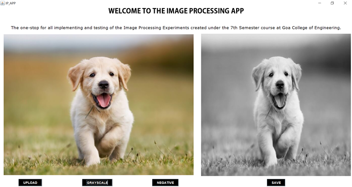

## EXPERIMENT 4
<b>OUTPUT</b> 
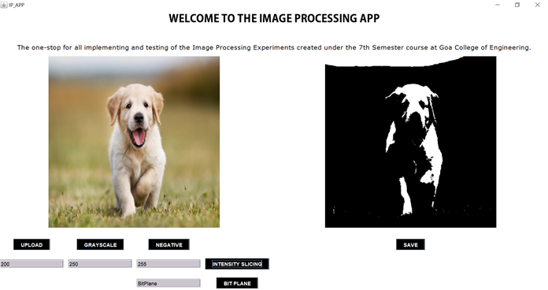
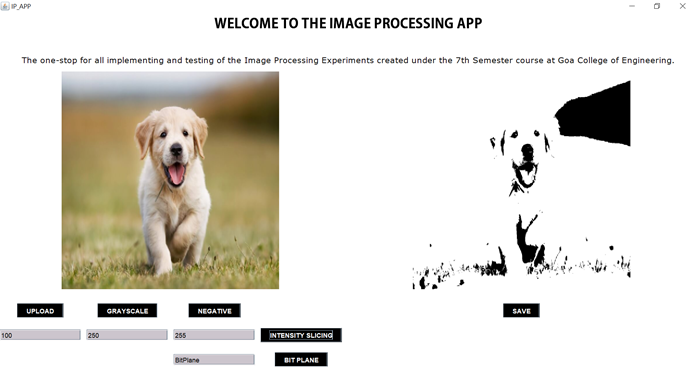
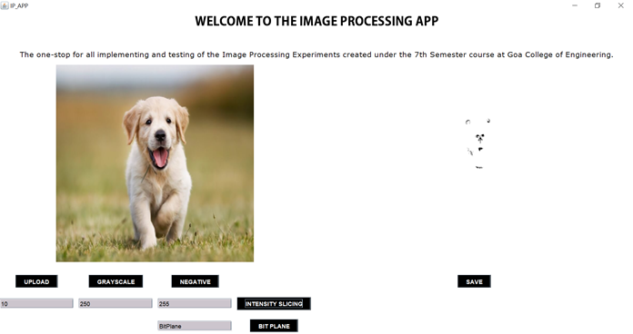
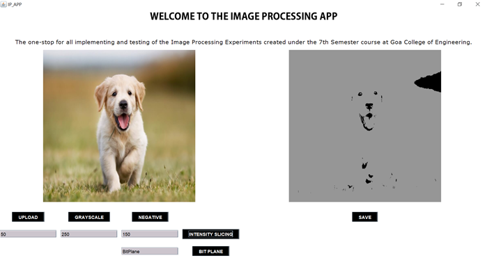
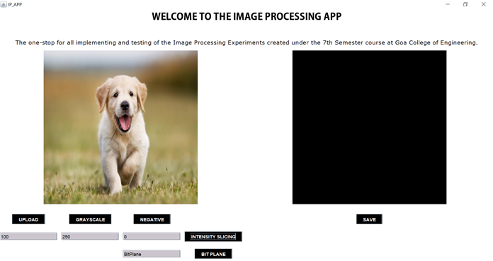

## EXPERIMENT 5
<b>OUTPUT</b> 
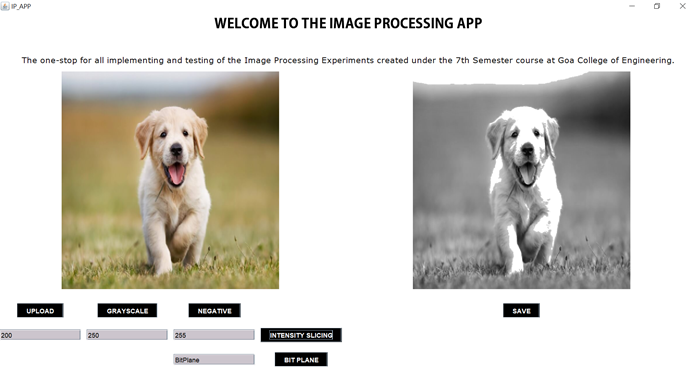
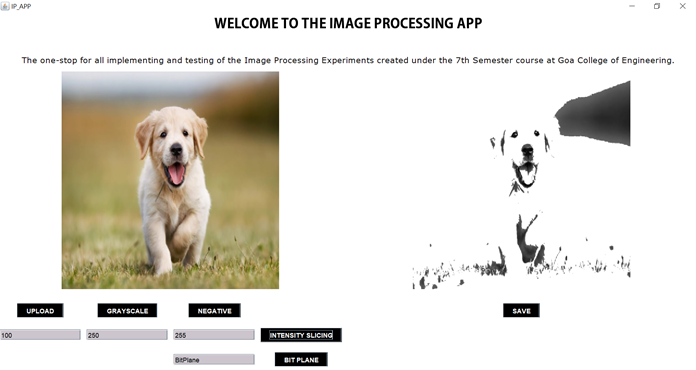
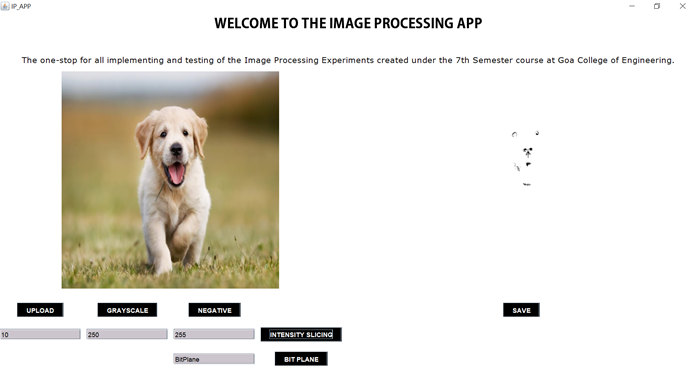
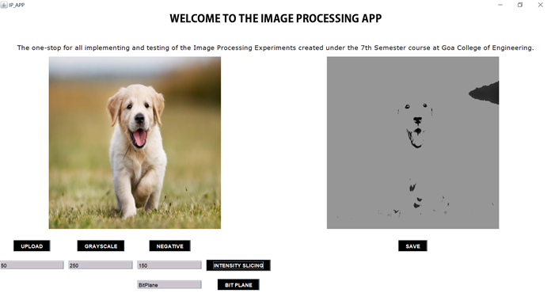
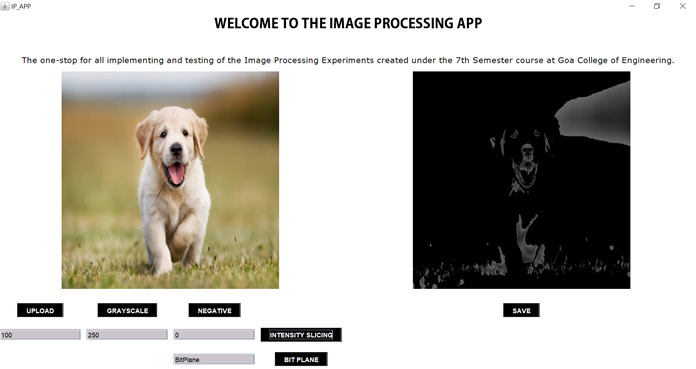

## EXPERIMENT 6
Bit-Plane Slicing is a technique in which the image is sliced at different planes. It ranges from Bit level 0 which is the least significant bit (LSB) to Bit level 7 which is the most significant bit (MSB). The input to this method is an 8-bit per pixel image.
 
<b>OUTPUT</b> 
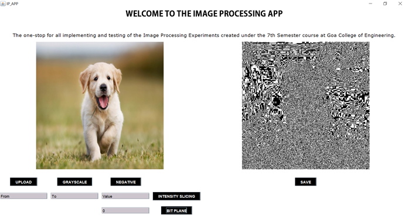
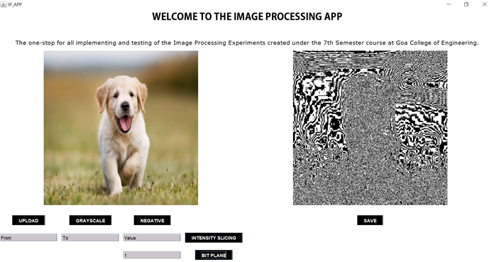
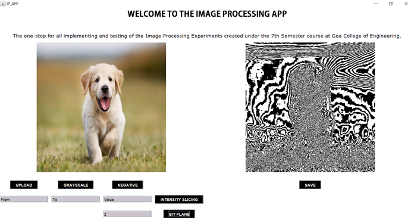
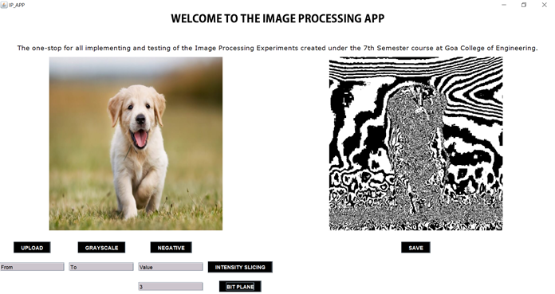
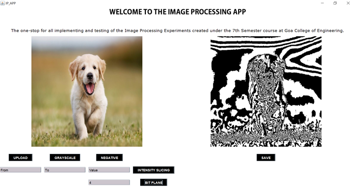
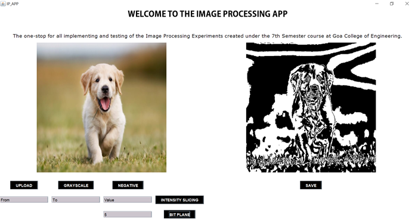
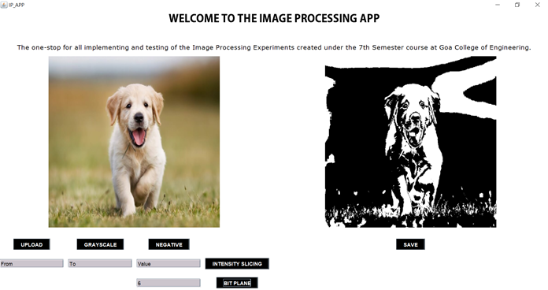
